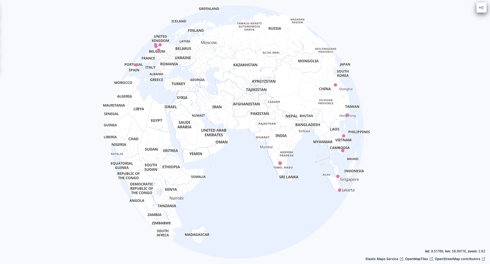
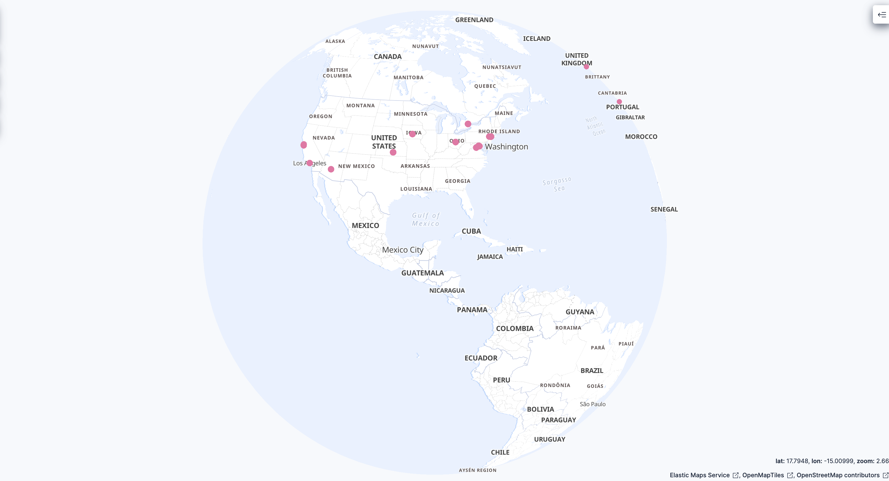

<div align="center">


<br/>


[](https://skillicons.dev)

<br/>

</div>

---

## 🍯 What Is This?

A **cloud-deployed SSH/Telnet honeypot** running on AWS EC2 that captures real-world attack traffic from the internet. Using Cowrie — an industry-standard medium-interaction honeypot — this lab logs every login attempt, command executed, and file downloaded by attackers. Logs are shipped in real-time via Filebeat to Elastic SIEM for threat detection, and visualized on a live Kibana attack map showing attacker origins across 9 countries.

> *"The best way to understand how attackers think is to let them think they've won."*

---

## 🎯 Objectives

- Deploy a production-grade honeypot on AWS EC2
- Capture and analyze real SSH brute-force attempts in real time
- Ship logs to Elastic SIEM via Filebeat for enterprise-grade threat detection
- Identify attacker patterns — botnet fingerprinting, credential stuffing, origins
- Visualize live attack map with GeoIP enrichment in Kibana
- Forward logs to AWS CloudWatch + Logs Insights for cloud-native attack queries
- Generate automated threat intelligence reports from raw logs
- Document findings as a real-world security research case study

---

## 🏗️ Architecture

```
┌─────────────────────────────────────────────────────────────┐
│                        Internet                             │
│            (Real attackers scanning the web)                │
└──────────────────────────┬──────────────────────────────────┘
                           │ SSH (port 22) / Telnet (port 23)
                           ▼
┌─────────────────────────────────────────────────────────────┐
│                  AWS EC2 (t2.micro)                         │
│                                                             │
│  ┌───────────────────────────────────────────────────────┐  │
│  │              iptables (port redirect)                 │  │
│  │         port 22 → 2222  |  port 23 → 2223            │  │
│  └────────────────────────┬──────────────────────────────┘  │
│                           │                                 │
│  ┌────────────────────────▼──────────────────────────────┐  │
│  │                 Cowrie Honeypot                       │  │
│  │    - Emulates vulnerable SSH/Telnet server            │  │
│  │    - Logs sessions to cowrie.json                     │  │
│  │    - Captures credentials, commands, downloads        │  │
│  └───────────┬───────────────────────┬───────────────────┘  │
│              │                       │                      │
│  ┌───────────▼──────────┐  ┌────────▼────────────────────┐  │
│  │  Python Analysis     │  │     Filebeat 8.17           │  │
│  │  - log_parser.py     │  │  Ships logs to Elastic SIEM │  │
│  │  - attack_analyzer.py│  └────────┬────────────────────┘  │
│  │  - geoip_lookup.py   │           │                       │
│  └───────────┬──────────┘           │                       │
│              │              ┌───────▼──────────────────────┐ │
│              │              │   AWS CloudWatch Logs        │ │
│              │              │   + Logs Insights Queries    │ │
│              │              └──────────────────────────────┘ │
└──────────────┼──────────────────────────────────────────────┘
               │
    ┌──────────▼────────────────────────────┐
    │         Elastic Cloud (SIEM)          │
    │  - Kibana Live Attack Map             │
    │  - GeoIP enrichment pipeline         │
    │  - Threat detection dashboards       │
    │  - Botnet fingerprint analysis       │
    └───────────────────────────────────────┘
```

---

## 📁 Project Structure

```
HoneyPot_Lab/
├── README.md                    # This file
├── setup/
│   ├── cowrie_setup.sh          # Automated Cowrie install script
│   └── security_groups.md      # AWS Security Group configuration
├── scripts/
│   ├── log_parser.py            # Parse Cowrie JSON logs → attack summary
│   ├── attack_analyzer.py       # Botnet fingerprinting + pattern analysis
│   ├── geoip_lookup.py          # Map attacker IPs to countries via ip-api.com
│   └── report_generator.py      # Auto-generate threat intel report
├── analysis/
│   ├── findings.md              # [Real threat intel findings →](analysis/findings.md)
│   └── sample_logs/             # Anonymized log samples
├── diagrams/
│   ├── architecture.png              # AWS architecture diagram
│   ├── kibana-attack-map-asia.png    # Live Kibana attack map - Asia Pacific
│   └── kibana-attack-map-americas.png # Live Kibana attack map - Americas
└── reports/
    └── attack_summary.md        # Generated threat intel report
```

---

## 🛠️ Tech Stack

| Component | Technology |
|---|---|
| Cloud Platform | AWS EC2 (t2.micro, Free Tier) |
| OS | Amazon Linux 2023 |
| Honeypot | Cowrie v2.9.14 |
| Python | 3.11 |
| Log Shipper | Filebeat 8.17 |
| SIEM | Elastic Cloud (Elasticsearch + Kibana) |
| GeoIP Enrichment | Elastic Ingest Pipeline (MaxMind GeoIP) |
| Attack Map | Kibana Maps (live, real-time) |
| Cloud Logging | AWS CloudWatch Logs |
| Cloud Query | AWS CloudWatch Logs Insights |
| Log Analysis | Python 3 (custom scripts) |
| GeoIP Lookup | ip-api.com |
| Admin Access | AWS Session Manager (no SSH keys) |

---

## 📊 What Gets Captured

Every attack session logged includes:

- **Attacker IP** and geolocation
- **Credentials attempted** (username + password combos)
- **Commands executed** inside the fake shell
- **Files downloaded** (malware samples)
- **Session duration** and timestamps
- **Attack signatures** and patterns

---

## 📈 Real Attack Data Captured

> Honeypot has been live since March 13, 2026

| Metric | Value |
|---|---|
| Total connection attempts | 102 |
| Unique attacker IPs | 24 |
| Countries represented | 9 |
| Successful logins | 26 |
| Unique botnets (HASSH) | 11 |
| Peak attack hour (UTC) | 18:00 (17 connections) |
| Top attacker org | Telekomunikasi Indonesia (40 connections) |
| Most used credential | root / password |

**Top attacking countries:** 🇮🇩 Indonesia (40) · 🇺🇸 United States (26) · 🇸🇬 Singapore (9) · 🇦🇺 Australia (8) · 🇮🇳 India (8)

**Key finding:** 4 DigitalOcean IPs sharing the same HASSH fingerprint (`SSH-2.0-Go`) across Singapore, India, Australia and US — coordinated botnet campaign.

📄 **[Read full threat intelligence findings →](analysis/findings.md)**

---

## 🗺️ Live Attack Map (Kibana)

> Real-time attacker origins visualized on Kibana Maps with GeoIP enrichment





---

## 🚧 Build Progress

- [x] Day 1 — Repo structure + README + architecture diagram
- [x] Day 2 — AWS EC2 setup + Security Groups configured
- [x] Day 3 — Cowrie installed and running
- [x] Day 4 — Verified capturing live traffic
- [x] Day 5 — `log_parser.py` complete
- [x] Day 6 — `attack_analyzer.py` — botnet fingerprinting + pattern analysis
- [x] Day 7 — `geoip_lookup.py` — 24 IPs mapped across 9 countries
- [x] Day 7.5 — Filebeat → Elastic SIEM pipeline live
- [x] Day 7.5 — Kibana live attack map with GeoIP enrichment
- [x] Day 8 — AWS CloudWatch agent + log forwarding
- [x] Day 9 — AWS CloudWatch Logs Insights (attack query dashboard)
- [x] Day 10 — `report_generator.py` — automated threat intel report
- [x] Day 11 — Real findings documented (7 key discoveries + MITRE ATT&CK mapping)
- [x] Day 12 — Attack map screenshots added to repo
- [x] Day 13 — Full README polish
- [ ] Day 14 — HackTrace article drafted
- [ ] Day 15 — v1.0 release

---

## ⚠️ Disclaimer

This honeypot is deployed on infrastructure I own and control. All captured data is used solely for educational research and threat intelligence analysis. Attacker IPs in published logs are anonymized. This project is intended to demonstrate defensive security research techniques.

---

## 👨‍💻 Author

**Ervin D'Souza** — MS Cybersecurity @ CCNY | Aspiring Cloud Security Engineer

[](https://www.linkedin.com/in/ervindsouzaa)
[](https://medium.com/@ervindsouza08)
[](https://github.com/CoderunED)

---

<div align="center">

*Part of an ongoing cloud security research series — follow along on HackTrace*


</div>
